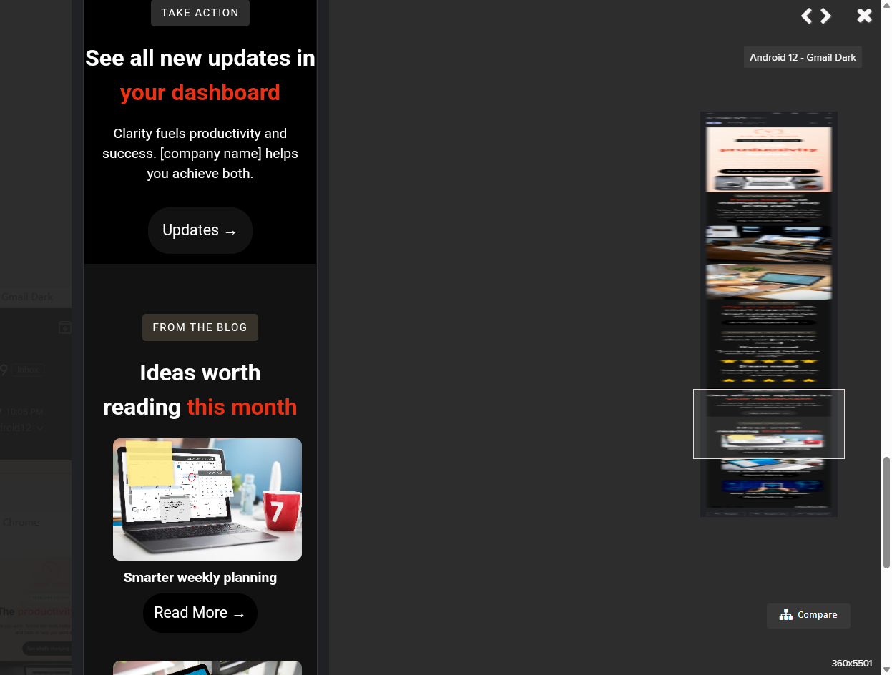

# productivity-email

Responsive email template designed for cross-client compatibility

## Features
- Fully responsive layout
- Tested in Gmail, Outlook, and Apple Mail
- Dark mode support
- VML buttons for Outlook
- Safe background images with VML fallback
- Modular, clean code

## Screenshots and video
[Apple Mail Video Demo](https://raw.githubusercontent.com/emilywilson-dev/productivity-email-live-images/main/apple-mail-mobile.MOV)

## How to View

### Option 1: View live in your browser (GitHub Pages)
Once GitHub Pages is enabled (see below), open:
https://https://emilywilson-dev.github.io/skincare-newsletter-email/

### Option 2: View locally
1. Click **Code → Download ZIP**  
2. Unzip the folder on your computer  
3. Open `index.html` in your browser to see the layout
